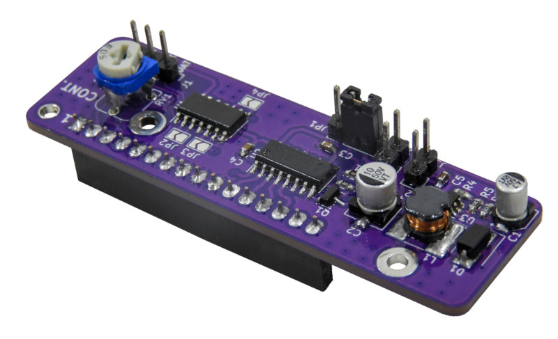

Yet another LCD Interface
=========================

The goal of the YALI (*Yet Another LCD Interface*) project is to provide a universal interface to drive the popular [Hitachi HD44780](https://en.wikipedia.org/wiki/Hitachi_HD44780_LCD_controller) LCD controller. This project offers open hardware module and C/C++ library for the HD44780 controller.

The hardware module of this project consists of a few CMOS logic ICs and a DC boost converter. This module designs to work with 5V and 3.3V DC power sources and logic circuits.

The YALI library is developed using C and is designed to be easily integrated with any C/C++ embedded toolchain. The current version of the YALI library provides built-in interfaces for the following embedded toolchains and platforms:

 - [Arduino](https://www.arduino.cc)
 - [STM32 with LibOpenCM3](https://github.com/libopencm3)
 - [ESP8266 RTOS SDK](https://github.com/espressif/ESP8266_RTOS_SDK)
 - [Mid-range PIC MCUs with MPLAB XC8](https://www.microchip.com/en-us/tools-resources/develop/mplab-xc-compilers)
 
The PCB of the YALI module can also order from the PCBWay website.

YALI is an open-source project. All the hardware designs and software source codes are available in the YALI project repository. Assembling and interfacing guide for YALI hardware module is also available in [YouTube video](https://youtu.be/gdLx3jKWsBA).
